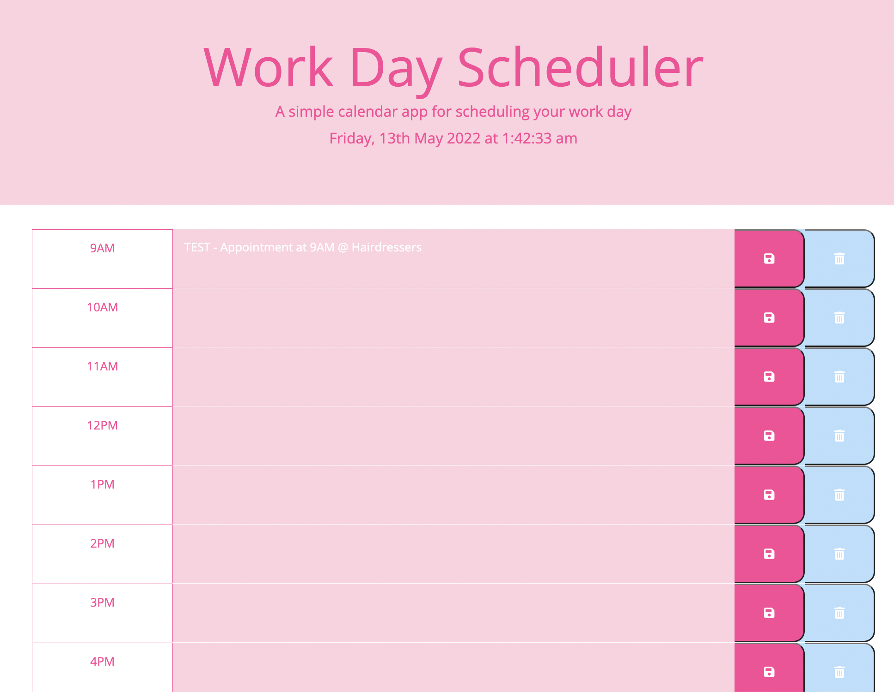

##HOMEWORK5 - Work Day Scheduler
-----------------------------------
For this project a Work Day Scheduler was created using Bootstrap, jQuery, Moment.js & Web APIs such as Google Fonts to personalise the website font family and Font Awesome to add icons to the buttons.
I have personalise not only the icons but the colour using the code base as the start point. The work day planner is meant to be fully responsive and interactive using the today's date and time in order to alterate the time blocks colour.

It contains: 
- Personalised icons from Font Awesome for both buttons in the Work Day Scheduler.
- Personalised font obtained using Google Fonts.
- Responsive buttons that can save and clear the data.
- Personalised colour scheme from the base code.

Link to deployed application: https://vicchyx.github.io/workday-scheduler/

Screenshots of project:

